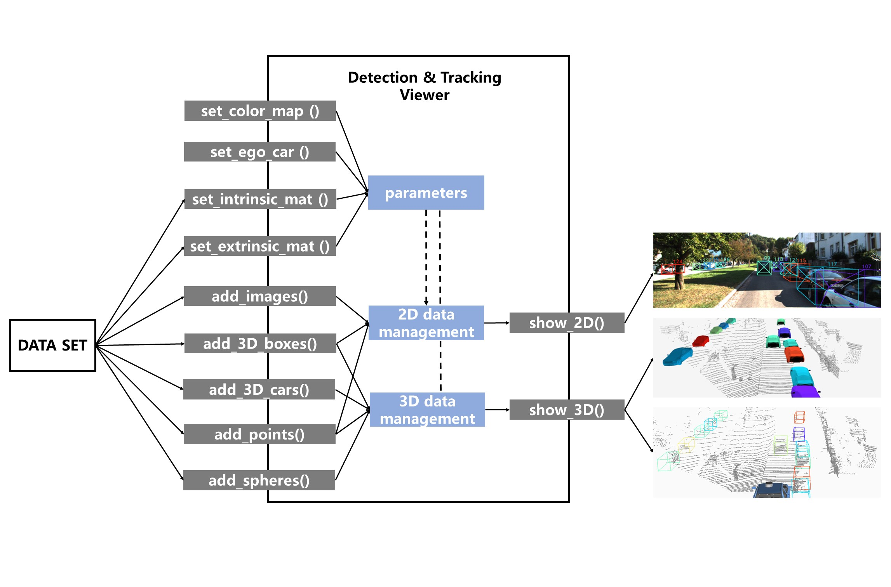

# 3D Detection & Tracking Viewer
This project was developed for view 3D object detection and tracking results.
It supports rendering 3D bounding boxes as car models and rendering boxes on images.

## Features
* Rendering boxes as cars
* Captioning box ids(infos) in 3D scene
* Projecting 3D box or points on 2D image  

## Design pattern
This code includes two parts, one for data loading, other one for visualization of 3D detection and tracking results.
The overall framework of design is shown below:

## Change log
* (2021.11.2) update 'Requirements'; update ```viewer/box_op.py``` to adapt 'vedo'.
## Prepare data 
* Kitti detection dataset
```
# For Kitti Detection Dataset         
└── kitti_detection
       ├── testing 
       |      ├──calib
       |      ├──image_2
       |      ├──label_2
       |      └──velodyne      
       └── training
              ├──calib
              ├──image_2
              ├──label_2
              └──velodyne 
```
* Kitti tracking dataset
```
# For Kitti Tracking Dataset         
└── kitti_tracking
       ├── testing 
       |      ├──calib
       |      |    ├──0000.txt
       |      |    ├──....txt
       |      |    └──0028.txt
       |      ├──image_02
       |      |    ├──0000
       |      |    ├──....
       |      |    └──0028
       |      ├──label_02
       |      |    ├──0000.txt
       |      |    ├──....txt
       |      |    └──0028.txt
       |      └──velodyne
       |           ├──0000
       |           ├──....
       |           └──0028      
       └── training # the structure is same as testing set
              ├──calib
              ├──image_02
              ├──label_02
              └──velodyne 
```
* Waymo dataset

Please refer to the  [OpenPCDet](https://github.com/open-mmlab/OpenPCDet)
for Waymo dataset organization.
## Requirements (Updated 2021.11.2)
```
python3
numpy==1.21.3
vedo==2021.0.6
vtk==9.0.3
opencv==4.5.4.58
matplotlib==3.4.3
```
## Usage
#### 1. Set boxes type & viewer background color

Currently this code supports Kitti (h,w,l,x,y,z,yaw) and Waymo OpenPCDet (x,y,z,l,w,h,yaw) box type.
You can set the box type and background color when initializing a viewer as 
```
from viewer.viewer import Viewer

vi = Viewer(box_type="Kitti",bg = (255,255,255))
```
#### 2. Set objects color map
You can set the objects color map for view tracking results, same as
 [matplotlib.pyplot](https://matplotlib.org/stable/tutorials/colors/colormaps.html) color map.
The common used color maps are "rainbow", "viridis","brg","gnuplot","hsv" and etc.
```
vi.set_ob_color_map('rainbow')
```
#### 3. Add colorized point clouds to 3D scene
The viewer receives a set of points, it must be a array with shape (N,3).
If you want to view the scatter filed, you should set the 'scatter_filed' with a shape (N,), and 
set the 'color_map_name' to specify the colors.
If the 'scatter_filed' is None, the points will show in color of 'color' arg.
```
vi.add_points(points[:,0:3],
               radius = 2,
               color = (150,150,150),
               scatter_filed = points[:,2],
               alpha=1,
               del_after_show = True,
               add_to_3D_scene = True,
               add_to_2D_scene = True,
               color_map_name = "viridis")
```


#### 4. Add boxes or cars to 3D scene
The viewer receives a set of boxes, it must be a array with shape (N,7). You can set the boxes to meshes or lines only,
you can also set the line width, conner points. Besides, you can provide a set of IDs(int) to colorize the boxes, and 
put a set of additional infos to caption the boxes. Note that, the color will set to the color of "color" arg if the
ids is None.
```
vi.add_3D_boxes(boxes=boxes[:,0:7],
                 ids=ids,
                 box_info=infos,
                 color="blue",
                 add_to_3D_scene=True,
                 mesh_alpha = 0.3,
                 show_corner_spheres = True,
                 corner_spheres_alpha = 1,
                 corner_spheres_radius=0.1,
                 show_heading = True,
                 heading_scale = 1,
                 show_lines = True,
                 line_width = 2,
                 line_alpha = 1,
                 show_ids = True,
                 show_box_info=True,
                 del_after_show=True,
                 add_to_2D_scene=True,
                 caption_size=(0.05,0.05)
                 )
```


You can also render the boxes as cars, the input format is same as boxes.
```
vi.add_3D_cars(boxes=boxes[:,0:7],
                 ids=ids,
                 box_info=infos,
                 color="blue",
                 mesh_alpha = 1,
                 show_ids = True,
                 show_box_info=True,
                 del_after_show=True,
                 car_model_path="viewer/car.obj",
                 caption_size = (0.1, 0.1)
                )
```


#### 5. View boxes or points on image
To view the 3D box and points on image, firstly should set the camera intrinsic, extrinsic mat, and put a image.
Besides, when adding the boxes and points, the 'add_to_2D_scene' should be set to True.
```
vi.add_image(image)
vi.set_extrinsic_mat(V2C)
vi.set_intrinsic_mat(P2)
```
#### 6. Show 2D and 3D results
To show a single frame, you can directly run ```vi.show_2D()```, ``` vi.show_3D()```. The visualization window will
not close until you press the "Enter" key. 
You can change the viewing angle by dragging the mouse within the visualization window.

To show multiple frames, you can use the for loop. While the code is running, please first click on the 3D window and then press the "Enter" key to view a sequence data.
```
for i in range(len(dataset)):
    V2C, P2, image, boxes = dataset[i]
    vi.add_3D_boxes(boxes)
    vi.add_image(image)
    vi.set_extrinsic_mat(V2C)
    vi.set_intrinsic_mat(P2)
    vi.show_2D()
    vi.show_3D()
```
       
